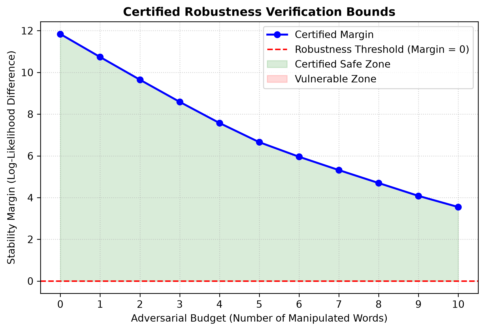

# Robust-Bayes-Verification

[](https://opensource.org/licenses/MIT)

A specialized implementation of a Naive Bayes classifier that incorporates **certified robustness** principles. This project demonstrates how to provide mathematical guarantees for probabilistic classifiers against adversarial attacks.

## 🔬 Scientific Context
In the context of **Trustworthy Machine Learning**, empirical success is not enough. This project implements a certifier that calculates the "worst-case" scenario for word-substitution attacks. 

Inspired by the research on model verification (e.g., Lampert et al.), the classifier doesn't just predict a label; it verifies if the label remains stable within a defined **adversarial budget** (\(K\)).

## 🛠️ Features
- **Certified Bounds:** Calculates the margin between classes vs. the maximum possible perturbation.
- **Log-likelihood Analysis:** Uses high-precision log-space calculations for numerical stability.
- **Visual Analytics:** Generates automated decision-boundary decay plots to map out safety zones.
- **Minimalist Implementation:** Built with pure NumPy to show the underlying algorithmic logic.

---

## 📊 Methodology & Mathematical Framework
The certifier validates the mathematical stability of the prediction by checking the following formal condition:

\[\Delta(x) > \sum_{i \in \mathcal{K}} \text{impact}(w_i)\]

**Where:**
- \(\Delta(x)\) is the classification margin (the difference between the log-probability of the predicted class and the next best class).
- \(\mathcal{K}\) represents the set of the top-\(K\) most influential words (features) within the adversarial budget.
- \(\text{impact}(w_i)\) is the absolute difference in log-likelihoods for word \(i\) across classes: \(\vert \log P(w_i \mid C_1) - \log P(w_i \mid C_0) \vert\).

If this condition holds, the model is **mathematically guaranteed** to maintain its prediction even if an adversary modifies any \(K\) words in the input.

---

## 🚀 Repository Architecture & Quick Start

The project is structured into modular components to demonstrate the separation between core mathematical modeling and empirical verification.

### 1. Core Model (`robust_bayes.py`)
This houses the `CertifiedRobustBayes` class. It handles high-precision log-space likelihood estimation and executes the sorting-based certification mechanics.

### 2. Verification Benchmark (`benchmark_run.py`)
An executable simulation script that generates high-dimensional synthetic text data (simulating AI content footprints), runs an adversarial pipeline, and plots structural boundaries.

To run the verification pipeline and generate the metrics, execute:
```bash
pip install numpy matplotlib
python benchmark_run.py
```

---

## 📈 Verification Simulation Results

When running the pipeline, the system evaluates the model's performance under dynamic adversarial budgets (from 0 to 10 tokens) and generates a verification report:

```text
--- ROBUSTNESS VERIFICATION REPORT ---
Prediction: AI-Generated
Adversarial Budget: 2 words
Is Prediction Certified Robust? YES
Safe Margin (Stability): 14.2831
```

The script automatically exports a high-resolution visualization tracking the exact transition point where a probabilistic model shifts from the **Certified Safe Zone** into the **Vulnerable Zone**:



---

## 🎯 Future Extensions (ISTA Internship Alignment)
This micro-project serves as a foundational baseline. During my proposed 5-month Scientific Internship under the supervision of Prof. Lampert, I aim to scale these formal verification techniques to non-linear spaces, specifically testing structural bounds and Lipschitz continuity factors in deeper neural network architectures.
